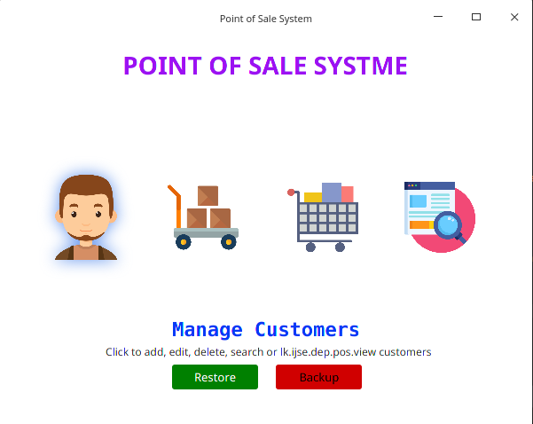
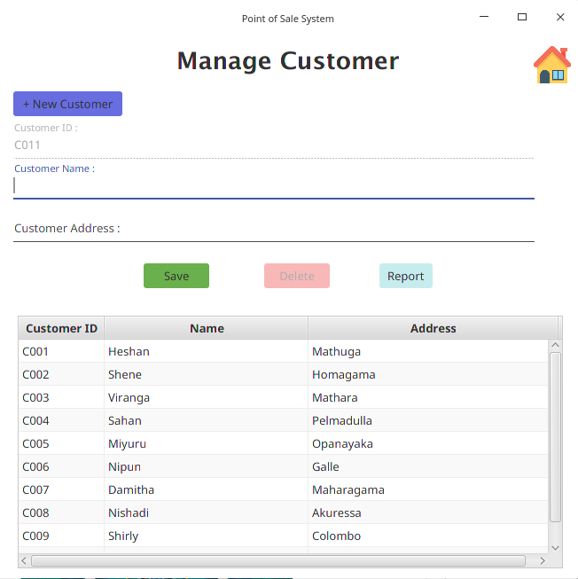

## POINT OF SALE SYSTEM 

This Point of Sale system complete with using Layered Architecture and JavaFx. 
This project facilitate it's users some features such as *Manage Customers*, *Mange Item*, 
*Place Orders*,*Search Orders.* and *generates Jasper Reports.* 

Database Auto Generate functionality also added to this project. 

Here is the Technology Stack that I take to complete this Point of sale system.

                        JDBC 
                        JavaSe
                        JavaFX
                        Scene Builder
                        Jasper Reports
                        Layerd Architecture
      

#### *This Project is copyright protection free only for study purposes*.

Here are some screen shots of this system.

